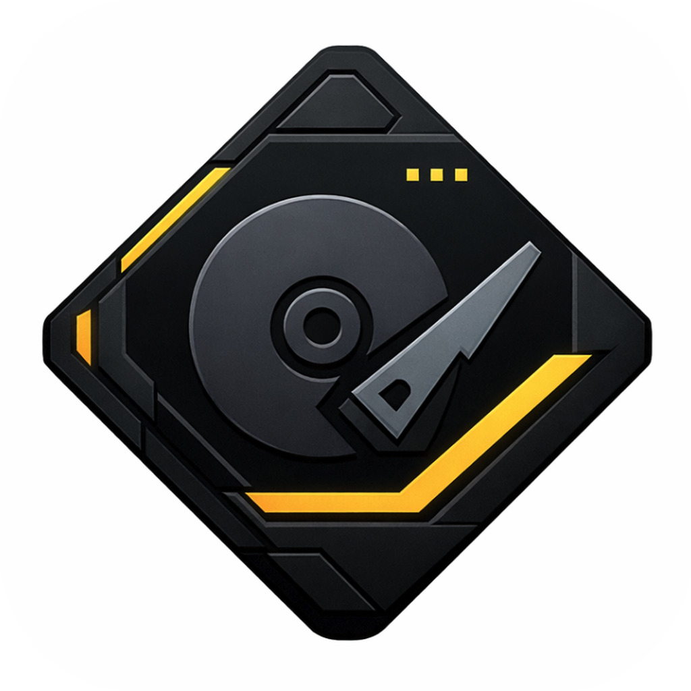

<div align="center">
  

  # DiskRookie 磁盘菜鸟

  <p align="center">
    
    
    
    
  </p>

  让傻子用户也能像电脑糕手一样清理磁盘。

  [快速开始](#快速开始) • [项目架构](#项目架构) • [开发计划](#开发计划) • [贡献指南](#贡献指南)
</div>


---

## 📸 功能预览

通过 AI 智能分析磁盘占用，快速识别可清理或迁移的文件，让磁盘管理变得简单高效。

<div align="center">

| AI 智能分析 | 分析结果展示 |
|:---:|:---:|
|  |  |

| 云存储迁移 | 可视化展示 |
|:---:|:---:|
|  |  |

| 自定义 AI 设置 | 批量操作 |
|:---:|:---:|
|  |  |

</div>

---

## ✨ 核心特性

- 🚀 **Rust 高性能扫描**：基于 Rust 核心构建，最高速度可达 1 秒扫描 5000 个文件，低内存占用，即使百万级文件也能流畅运行。
- 🤖 **AI 智能分析**：扫描完成后由 AI 系统自动分析文件用途，智能决定哪些需要删除、哪些需要迁移，所有建议需用户确认确保安全。
- 🌐 **网盘无缝对接**：AI 建议迁移的文件只需点击一下即可上传到 Google Drive、OneDrive、阿里云盘、百度网盘或通过 WebDAV 连接的 NAS。


---

## 🚀 快速开始

### 🛠️ 环境准备

确保你的开发环境已安装以下工具：

* **Rust**: `rustc 1.86+`
* **Node.js**: `v20+`
* **包管理器**: `npm` 或 `pnpm`

### 🖥️ 开发调试

```bash
# 1. 克隆项目
git clone [https://github.com/your-username/DiskRookie.git](https://github.com/your-username/DiskRookie.git)
cd DiskRookie/apps/desktop

# 2. 安装前端依赖
cd frontend && npm install && cd ..

# 3. 启动开发模式 (自动开启 Rust 后端与 React 前端)
npm run dev

```

### 📦 构建发布

```bash
cd apps/desktop
npx tauri build --target x86_64-pc-windows-msvc
```

---

## 🗺️ 开发计划

我们正在积极开发以下功能，让 DiskRookie 变得更加强大和易用：

### 1. 🌐 扩展云存储支持
- **目标**：兼容更多云存储厂商，提供更灵活的迁移选择
- **计划支持**：
  - 夸克网盘
  - Dropbox
  - 更多主流云存储服务

### 2. 🤖 增强 AI 模型兼容性
- **目标**：支持更多大模型，包括本地部署方案
- **计划功能**：
  - 兼容本地部署的 Ollama
  - 测试和优化不同模型的性能表现
  - 提供模型选择与切换功能

### 3. 🎨 优化用户体验
- **目标**：让完全没有电脑知识的小白也能轻松使用
- **计划改进**：
  - 简化操作流程，实现一键无脑管理磁盘
  - 优化 UI 交互，提供更直观的操作指引
  - 增强错误提示和帮助文档

### 4. 🔧 完善 CI/CD 流程
- **目标**：构建完善的 GitHub workflow，提升开发效率
- **计划功能**：
  - 软件层面的基础测试自动化
  - 一键式构建和发布流程
  - 多平台构建支持（Windows、macOS、Linux）

### 5. 🌍 构建门户网站
- **目标**：为软件创建一个简单的门户网站
- **计划内容**：
  - 介绍软件的理念和概念
  - 承载用户条款和隐私政策
  - 提供下载和文档入口

---

## 📄 许可证

本项目采用 [Apache License 2.0](https://www.google.com/search?q=LICENSE) 许可证。

Copyright © 2026 **AI Disk Analyzer Contributors**.
